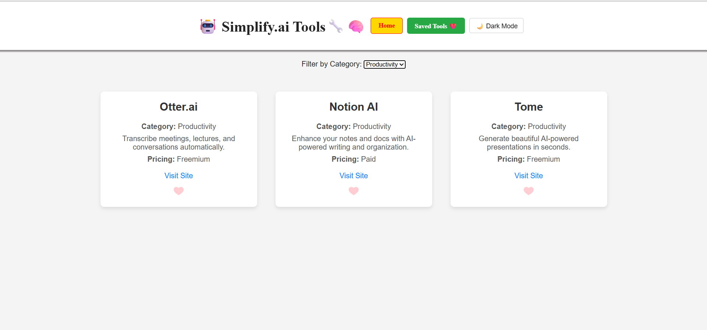
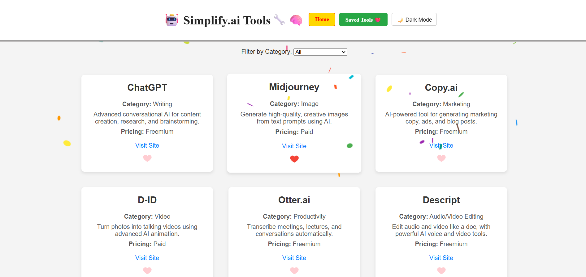
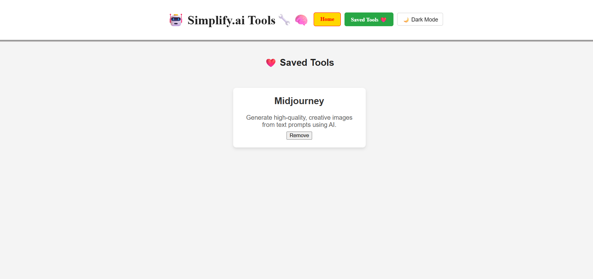
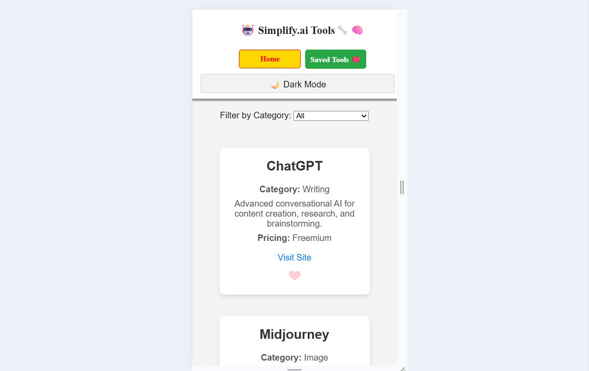

### AI Tools Directory – MERN Stack Project

**Overview**
*This is a full-stack MERN application that displays information about various AI tools in a card-based layout. Each tool card shows essential details such as the tool name, category, pricing, description, and a direct link to visit the official website.*

*Users can filter tools by category, like or unlike tools using a heart icon, and view all liked tools on a dedicated Favorites page. The backend uses a file-based data source (no database) to manage tool information and user interactions.*


**Features**
   1. AI Tool Cards: Each tool is displayed in a card format containing:
      - Tool name
      - Category
      - Pricing information
      - Short description
      - “Visit Site” external link
      - Like / Unlike heart icon

   2. Navigation
      - Home – Displays all available AI tools
      - Favorite Tools – Displays only the tools liked by the user
      - Heart icon in the navbar for quick access and visual feedback

   3. Like & Unlike Functionality
      - Users can like a tool by clicking the heart icon
      - Clicking the heart again removes it from favorites
      - Favorite tools are instantly reflected in the Favorite Tools page

   4. Category Filtering    
      - Users can filter AI tools based on categories
      - Filters work dynamically on frontend data fetched from the backend

   5. Backend (No Database)
      - No database is used
      - Tool data is stored and managed in a data file
      - Backend API handles:
         - Fetching tools
         - Filtering tools
         - Managing liked/favorite tools


**Technology Stack**
   1. Frontend
      - React
      - JavaScript
      - CSS (Flexbox / Grid)
      - Fetch / Axios for API calls

   2. Backend
      - Node.js
      - Express.js
      - File-based data handling (JSON / JS data file)


**Application Flow**
   1. Frontend fetches tool data from the backend API

   2. Tools are displayed as responsive cards

   3. User can:
      - Filter tools by category
      - Like or unlike tools
      - View liked tools on the Favorites page

   4. Backend updates and serves data from a file without using a database


**Responsive Design**
   - Fully responsive UI
   - Optimized for:
      - Desktop
      - Tablet
      - Mobile devices


**📸 Screenshots**

## Homepage (Light Mode)


## Homepage (Dark Mode)


## Homepage (Filtered Light Mode)


## Homepage (Confetti Animation)


## Saved Tools Page (Light Mode)


## No Saved Tools Page (Light Mode)


## Homepage (Mobile Light Mode)


## Homepage (Mobile Dark Mode)


## Saved Tools Page (Mobile Light Mode)


## Saved Tools Page (Mobile Dark Mode)


**Project Structure**
   - Modular frontend components
   - REST API–based backend
   - Clear separation of:
      - UI
      - Business logic
      - Data handling


**Use Cases**
This project is suitable for:
   1. AI tools listing platforms

   2. Learning MERN stack fundamentals

   3. Understanding file-based backend data management

   4. Demonstrating state management and user interactions in React


**🤖 How to Run**

To run this app, you need to open **two terminals** — one for the frontend and one for the backend.

- In the **frontend** terminal, run:

  ```bash
  npm start

- In the **backend** terminal, run:

   ```bash
   node index.js
   


**🎁 Bonus Features**
Here are two bonus features added to enhance the user experience:

   1. 🌗 Dark Mode / Light Mode Toggle
      - Users can switch between dark and light themes.

   2. 🎉 Confetti Animation
      - When you like a tool, a confetti effect appears to celebrate the action.


**Author**
    *- Sourabh (https://github.com/Sourabh108-Coder/)*